# DiagramForge

[](https://github.com/jongalloway/DiagramForge/actions/workflows/ci.yml)
[](https://www.nuget.org/packages/DiagramForge)
[](https://www.nuget.org/packages/DiagramForge)
[](https://mermaid.js.org)

**Text in, SVG out.** A .NET library and CLI that turns plain-text diagram descriptions into clean, self-contained SVG — no browser, no JavaScript runtime, no headless Chrome.

Representative snapshot fixtures from the E2E suite. Click any thumbnail to open the full-size SVG.

<!-- markdownlint-disable MD033 -->
<h3>Diagram Types</h3>

DiagramForge currently supports more than a dozen diagram types across Mermaid and the conceptual DSL. This gallery is representative, not complete, and includes a few icon-enabled examples. See [Supported syntax](#supported-syntax) and [Conceptual DSL](#conceptual-dsl) below for the full set and syntax details.

<table cellpadding="12" width="100%">
  <tr>
    <td align="center" valign="top" width="33%">
      <a href="https://github.com/jongalloway/DiagramForge/blob/main/tests/DiagramForge.E2ETests/Fixtures/mermaid-flowchart-icons.expected.svg">
        
      </a>
      <br />
      <sub>Flowchart + Icons</sub>
    </td>
    <td align="center" valign="top" width="33%">
      <a href="https://github.com/jongalloway/DiagramForge/blob/main/tests/DiagramForge.E2ETests/Fixtures/mermaid-block.expected.svg">
        
      </a>
      <br />
      <sub>Block</sub>
    </td>
    <td align="center" valign="top" width="33%">
      <a href="https://github.com/jongalloway/DiagramForge/blob/main/tests/DiagramForge.E2ETests/Fixtures/mermaid-sequence.expected.svg">
        
      </a>
      <br />
      <sub>Sequence</sub>
    </td>
  </tr>
  <tr>
    <td align="center" valign="top" width="33%">
      <a href="https://github.com/jongalloway/DiagramForge/blob/main/tests/DiagramForge.E2ETests/Fixtures/mermaid-architecture-icons.expected.svg">
        
      </a>
      <br />
      <sub>Architecture + Icons</sub>
    </td>
    <td align="center" valign="top" width="33%">
      <a href="https://github.com/jongalloway/DiagramForge/blob/main/tests/DiagramForge.E2ETests/Fixtures/mermaid-mindmap.expected.svg">
        
      </a>
      <br />
      <sub>Mindmap</sub>
    </td>
    <td align="center" valign="top" width="33%">
      <a href="https://github.com/jongalloway/DiagramForge/blob/main/tests/DiagramForge.E2ETests/Fixtures/mermaid-timeline.expected.svg">
        
      </a>
      <br />
      <sub>Timeline</sub>
    </td>
  </tr>
  <tr>
    <td align="center" valign="top" width="33%">
      <a href="https://github.com/jongalloway/DiagramForge/blob/main/tests/DiagramForge.E2ETests/Fixtures/mermaid-venn-two-set.expected.svg">
        
      </a>
      <br />
      <sub>Venn</sub>
    </td>
    <td align="center" valign="top" width="33%">
      <a href="https://github.com/jongalloway/DiagramForge/blob/main/tests/DiagramForge.E2ETests/Fixtures/mermaid-xychart.expected.svg">
        
      </a>
      <br />
      <sub>XY Chart</sub>
    </td>
    <td align="center" valign="top" width="33%">
      <a href="https://github.com/jongalloway/DiagramForge/blob/main/tests/DiagramForge.E2ETests/Fixtures/conceptual-cycle-icons.expected.svg">
        
      </a>
      <br />
      <sub>Conceptual Cycle + Icons</sub>
    </td>
  </tr>
  <tr>
    <td align="center" valign="top" width="33%">
      <a href="https://github.com/jongalloway/DiagramForge/blob/main/tests/DiagramForge.E2ETests/Fixtures/conceptual-matrix-icons.expected.svg">
        
      </a>
      <br />
      <sub>Conceptual Matrix + Icons</sub>
    </td>
    <td align="center" valign="top" width="33%">
      <a href="https://github.com/jongalloway/DiagramForge/blob/main/tests/DiagramForge.E2ETests/Fixtures/conceptual-pillars-icons.expected.svg">
        
      </a>
      <br />
      <sub>Conceptual Pillars + Icons</sub>
    </td>
    <td align="center" valign="top" width="33%">
      <a href="https://github.com/jongalloway/DiagramForge/blob/main/tests/DiagramForge.E2ETests/Fixtures/conceptual-pyramid.expected.svg">
        
      </a>
      <br />
      <sub>Conceptual Pyramid</sub>
    </td>
  </tr>
  <tr>
    <td align="center" valign="top" width="33%">
      <a href="https://github.com/jongalloway/DiagramForge/blob/main/tests/DiagramForge.E2ETests/Fixtures/conceptual-funnel-icons.expected.svg">
        
      </a>
      <br />
      <sub>Conceptual Funnel + Icons</sub>
    </td>
    <td align="center" valign="top" width="33%">
      <a href="https://github.com/jongalloway/DiagramForge/blob/main/tests/DiagramForge.E2ETests/Fixtures/conceptual-radial-icons.expected.svg">
        
      </a>
      <br />
      <sub>Conceptual Radial + Icons</sub>
    </td>
    <td align="center" valign="top" width="33%">
      <a href="https://github.com/jongalloway/DiagramForge/blob/main/tests/DiagramForge.E2ETests/Fixtures/conceptual-snake-presentation.expected.svg">
        
      </a>
      <br />
      <sub>Snake Timeline</sub>
    </td>
  </tr>
  <tr>
    <td align="center" valign="top" width="33%">
      <a href="https://github.com/jongalloway/DiagramForge/blob/main/tests/DiagramForge.E2ETests/Fixtures/conceptual-snake-dracula.expected.svg">
        
      </a>
      <br />
      <sub>Snake Timeline (Dracula)</sub>
    </td>
  </tr>
</table>

<h3>Built-in Themes</h3>

This theme gallery is also a representative sample rather than the full catalog. DiagramForge ships with 23 built-in themes: `default`, `zinc-light`, `zinc-dark`, `dark`, `neutral`, `forest`, `presentation`, `prism`, `angled-light`, `angled-dark`, `github-light`, `github-dark`, `nord`, `nord-light`, `dracula`, `tokyo-night`, `tokyo-night-storm`, `tokyo-night-light`, `catppuccin-latte`, `catppuccin-mocha`, `solarized-light`, `solarized-dark`, and `one-dark`. See [With a custom theme](#with-a-custom-theme), [doc/theming.md](doc/theming.md), and [doc/frontmatter.md](doc/frontmatter.md) for the full styling surface.

<table cellpadding="16" width="100%">
  <tr>
    <td align="center" valign="top" width="50%">
      <a href="https://github.com/jongalloway/DiagramForge/blob/main/tests/DiagramForge.E2ETests/Fixtures/mermaid-theme-default.expected.svg">
        
      </a>
      <br />
      <sub>Default</sub>
    </td>
    <td align="center" valign="top" width="50%">
      <a href="https://github.com/jongalloway/DiagramForge/blob/main/tests/DiagramForge.E2ETests/Fixtures/mermaid-theme-forest.expected.svg">
        
      </a>
      <br />
      <sub>Forest</sub>
    </td>
  </tr>
  <tr>
    <td align="center" valign="top" width="50%">
      <a href="https://github.com/jongalloway/DiagramForge/blob/main/tests/DiagramForge.E2ETests/Fixtures/mermaid-theme-neutral.expected.svg">
        
      </a>
      <br />
      <sub>Neutral</sub>
    </td>
    <td align="center" valign="top" width="50%">
      <a href="https://github.com/jongalloway/DiagramForge/blob/main/tests/DiagramForge.E2ETests/Fixtures/mermaid-theme-dracula.expected.svg">
        
      </a>
      <br />
      <sub>Dracula</sub>
    </td>
  </tr>
  <tr>
    <td align="center" valign="top" width="50%">
      <a href="https://github.com/jongalloway/DiagramForge/blob/main/tests/DiagramForge.E2ETests/Fixtures/mermaid-theme-github-dark.expected.svg">
        
      </a>
      <br />
      <sub>GitHub Dark</sub>
    </td>
    <td align="center" valign="top" width="50%">
      <a href="https://github.com/jongalloway/DiagramForge/blob/main/tests/DiagramForge.E2ETests/Fixtures/mermaid-theme-github-light.expected.svg">
        
      </a>
      <br />
      <sub>GitHub Light</sub>
    </td>
  </tr>
  <tr>
    <td align="center" valign="top" width="50%">
      <a href="https://github.com/jongalloway/DiagramForge/blob/main/tests/DiagramForge.E2ETests/Fixtures/mermaid-theme-catppuccin-latte.expected.svg">
        
      </a>
      <br />
      <sub>Catppuccin Latte</sub>
    </td>
    <td align="center" valign="top" width="50%">
      <a href="https://github.com/jongalloway/DiagramForge/blob/main/tests/DiagramForge.E2ETests/Fixtures/mermaid-theme-catppuccin-mocha.expected.svg">
        
      </a>
      <br />
      <sub>Catppuccin Mocha</sub>
    </td>
  </tr>
  <tr>
    <td align="center" valign="top" width="50%">
      <a href="https://github.com/jongalloway/DiagramForge/blob/main/tests/DiagramForge.E2ETests/Fixtures/mermaid-theme-presentation.expected.svg">
        
      </a>
      <br />
      <sub>Presentation</sub>
    </td>
    <td align="center" valign="top" width="50%">
      <a href="https://github.com/jongalloway/DiagramForge/blob/main/tests/DiagramForge.E2ETests/Fixtures/mermaid-theme-tokyo-night.expected.svg">
        
      </a>
      <br />
      <sub>Tokyo Night</sub>
    </td>
  </tr>
  <tr>
    <td align="center" valign="top" width="50%">
      <a href="https://github.com/jongalloway/DiagramForge/blob/main/tests/DiagramForge.E2ETests/Fixtures/mermaid-theme-one-dark.expected.svg">
        
      </a>
      <br />
      <sub>One Dark</sub>
    </td>
    <td align="center" valign="top" width="50%">
      <a href="https://github.com/jongalloway/DiagramForge/blob/main/tests/DiagramForge.E2ETests/Fixtures/mermaid-theme-zinc-light.expected.svg">
        
      </a>
      <br />
      <sub>Zinc Light</sub>
    </td>
  </tr>
</table>
<!-- markdownlint-enable MD033 -->

```csharp
var renderer = new DiagramRenderer();
string svg = renderer.Render("""
    flowchart LR
      A[Write] --> B[Build]
      B --> C{Tests pass?}
      C -->|yes| D[Ship]
      C -->|no| A
    """);
```

That's the whole API.

## Why

Most diagram-as-code tools assume a browser. Mermaid.js needs a JavaScript engine to run at all — and even once you've stood up headless Chrome and extracted the SVG, you find that it renders text via `<foreignObject>` wrapping HTML `<div>`s instead of native `<text>` elements. That's fine in a web page. It's a blank box in Inkscape, a parse error in Illustrator, and a mess when you try to drop it into a PowerPoint slide. See mermaid-js/mermaid [#2688](https://github.com/mermaid-js/mermaid/issues/2688), [#1845](https://github.com/mermaid-js/mermaid/issues/1845), [#1923](https://github.com/mermaid-js/mermaid/issues/1923), [#2169](https://github.com/mermaid-js/mermaid/issues/2169).

DiagramForge aims lower and hits harder: a **subset** of Mermaid, rendered to **actual** SVG. Flowcharts, block diagrams, sequence diagrams, state diagrams, mindmaps, timelines, Venn diagrams, architecture diagrams, and XY charts — the output opens anywhere.

- **Real SVG.** Native `<text>` elements. No `<foreignObject>`, no embedded HTML, no CSS-in-SVG. Opens in Inkscape, imports into PowerPoint and Keynote, renders with librsvg.
- **Pure .NET.** `net10.0`, zero native dependencies, zero runtime package dependencies. No headless browser, no Node, no shelling out.
- **Deterministic.** Same input → byte-identical output. Safe to snapshot-test.
- **Theme-able.** Colors, fonts, spacing, corner radius — all overridable.
- **Pluggable.** Drop in your own `IDiagramParser` for custom syntaxes.

## Install

DiagramForge targets `.NET 10`. For local development and the CLI tool, use SDK/runtime `10.0.100` or later.

### Library

```sh
dotnet add package DiagramForge
```

### CLI (`dnx`)

```sh
dnx DiagramForge.Tool --help
```

With `.NET 10`, `dnx` can run the tool package directly without a prior install.

## Library usage

### Basic

```csharp
using DiagramForge;

var renderer = new DiagramRenderer();
string svg = renderer.Render(diagramText);
File.WriteAllText("out.svg", svg);
```

The renderer auto-detects the syntax from the input. No need to tell it whether it's Mermaid or Conceptual DSL.

### With a custom theme

```csharp
using DiagramForge;
using DiagramForge.Models;

var theme = new Theme
{
    NodeFillColor   = "#1F2937",
    NodeStrokeColor = "#6366F1",
    TextColor       = "#F9FAFB",
    FontFamily      = "Inter, sans-serif",
    BorderRadius    = 12,
  TransparentBackground = true,
};

string svg = new DiagramRenderer().Render(diagramText, theme);
```

Theme precedence: **frontmatter theme** -> **parser-assigned `Diagram.Theme`** -> **argument theme** -> **`Theme.Default`**.

See [doc/theming.md](doc/theming.md) for the full `Theme` property surface and [doc/frontmatter.md](doc/frontmatter.md) for diagram-embedded styling.

### With diagram frontmatter

Diagram files can embed a small frontmatter block ahead of Mermaid or Conceptual DSL content:

```text
---
theme: dracula
palette: ["#FFB86C", "#8BE9FD", "#50FA7B"]
borderStyle: rainbow
fillStyle: diagonal-strong
shadowStyle: soft
transparent: true
---
flowchart LR
  A[Plan] --> B[Build]
  B --> C[Ship]
```

Supported frontmatter keys today: `theme`, `palette`, `borderStyle` / `border-style`, `fillStyle` / `fill-style`, `shadowStyle` / `shadow-style`, and `transparent` / `transparentBackground` / `transparent-background`.

### With a custom parser

```csharp
using DiagramForge;
using DiagramForge.Abstractions;

var renderer = new DiagramRenderer()
    .RegisterParser(new MyDotParser());   // tried before built-in parsers

// See what's registered
foreach (var id in renderer.RegisteredSyntaxes)
    Console.WriteLine(id);   // mydot, mermaid, conceptual
```

Implement `IDiagramParser`. You get two methods: `CanParse(string)` for sniffing the input, and `Parse(string)` which produces the unified `Diagram` model. Layout and rendering are handled for you.

### Icon support

DiagramForge can render icons inside supported Mermaid flowchart nodes and supported Conceptual DSL nodes.

The core package registers a built-in icon pack named `builtin` automatically. The built-in icons are:

- `builtin:cloud`
- `builtin:database`
- `builtin:disk`
- `builtin:internet`
- `builtin:server`

Icon references use the syntax `icon:pack:name` in diagram text.

Supported icon-bearing diagram types today:

- Mermaid flowchart
- Conceptual cycle
- Conceptual chevrons
- Conceptual funnel
- Conceptual matrix
- Conceptual pillars
- Conceptual pyramid
- Conceptual radial

For conceptual matrix diagrams, icons are attached per cell through an optional `cells:` list in row-major order. Non-empty cell entries must contain an icon directive; use a blank `-` to leave a cell without an icon.

```yaml
diagram: matrix
rows:
  - Important
  - Not Important
columns:
  - Urgent
  - Not Urgent
cells:
  - icon:builtin:cloud
  -
  - Lower-left [icon:heroicons:shield-check]
  - [icon:builtin:database]
```

#### Registering an icon pack

Use `RegisterIconPack()` to add your own pack, or install `DiagramForge.Icons.Heroicons` and call `UseHeroicons()`.

```csharp
using DiagramForge;
using DiagramForge.Icons.Heroicons;

var renderer = new DiagramRenderer()
    .UseHeroicons();
```

If you want to register your own pack directly:

```csharp
using DiagramForge;
using DiagramForge.Abstractions;
using DiagramForge.Models;

public sealed class CustomIcons : IIconProvider
{
    public DiagramIcon? GetIcon(string name)
        => name == "rocket"
            ? new DiagramIcon(
                pack: "custom",
                name: "rocket",
                viewBox: "0 0 24 24",
                svgContent: "<path d=\"M12 2L15 9L22 12L15 15L12 22L9 15L2 12L9 9Z\" fill=\"none\" stroke=\"currentColor\" stroke-width=\"1.5\"/>"
            )
            : null;

    public IEnumerable<string> AvailableIcons => ["rocket"];
}

var renderer = new DiagramRenderer()
    .RegisterIconPack("custom", new CustomIcons());
```

#### Mermaid flowchart syntax

For flowcharts, place the icon reference directly in the node label.

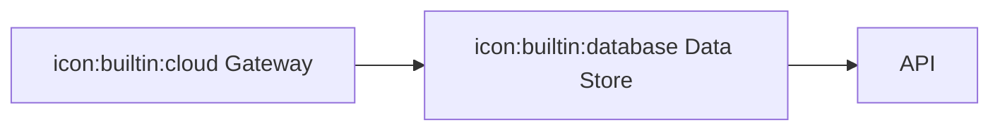

#### Conceptual DSL syntax

For conceptual diagrams, use either of these forms where the diagram type accepts labeled nodes:

- Leading form: `icon:pack:name Label`
- Trailing form: `Label [icon:pack:name]`

Example cycle:

```text
diagram: cycle
steps:
  - icon:builtin:cloud Discover
  - Build
  - Launch
```

Example pillars:

```text
diagram: pillars
pillars:
  - title: icon:builtin:cloud People
    segments:
      - Skills [icon:builtin:server]
      - Roles
  - title: Process
    segments:
      - Intake
      - Delivery [icon:builtin:database]
```

#### Heroicons pack

The optional `DiagramForge.Icons.Heroicons` package registers the pack name `heroicons` via `UseHeroicons()`.

After registration, diagram text can reference icons such as:

- `icon:heroicons:shield-check`
- `icon:heroicons:server-stack`

#### Current behavior and limitations

- Icons render above the label text using the shared node icon layout.
- Flowchart nodes currently use the same above-label icon placement as other supported nodes.
- Per-node icon color overrides are not supported.
- Per-node icon size overrides are not supported in the public DSL.
- Multiple icons per node are not supported.

### Example Copilot skills

If you want end-user workflow assets for AI-assisted diagram authoring and publishing, see:

- [doc/copilot-skills.md](doc/copilot-skills.md)
- [examples/copilot-skills](examples/copilot-skills/README.md)

These example skills show how to:

- generate Mermaid or Conceptual DSL source from prose or bullets,
- render diagram fences in markdown to SVG in bulk,
- optionally rewrite markdown to published SVG image references while preserving source.

The companion script for the render/publish workflow is [scripts/Render-MarkdownDiagrams.ps1](scripts/Render-MarkdownDiagrams.ps1).

## CLI usage

```text
dnx DiagramForge.Tool <input-file> [options]
```

| Argument | Description |
| --- | --- |
| `<input-file>` | Path to a diagram source file. Syntax auto-detected. |
| `-o`, `--output <path>` | Write SVG to a file. Omit to write to stdout. |
| `--theme <name>` | Use one of the built-in named themes. |
| `--palette <json>` | Override the theme's node palette with a JSON array of hex colors. |
| `--theme-file <path.json>` | Load a complete theme object from JSON. |
| `--transparent` | Omit the SVG background rect for overlay/embed use. |
| `--list-themes` | Print all built-in theme names (one per line) and exit. |
| `-h`, `--help` | Show usage. |

**Exit codes:** `0` success · `1` bad arguments / file not found · `2` parse error · `3` unexpected failure.

CLI precedence mirrors the library API: frontmatter can define theme and styling inside the diagram source, while explicit CLI flags win for `--palette` and `--transparent`.

```sh
# write to file
dnx DiagramForge.Tool diagram.mmd -o diagram.svg

# render for overlay on an existing page background
dnx DiagramForge.Tool diagram.mmd --theme dracula --transparent -o overlay.svg

# pipe to something else
dnx DiagramForge.Tool diagram.txt | rsvg-convert -o diagram.png
```

## Supported syntax

### Mermaid (subset)

DiagramForge intentionally implements a focused Mermaid subset rather than full Mermaid parity. The first non-frontmatter line must start with one of the supported keywords below.

| Diagram family | Keywords | Current support |
| --- | --- | --- |
| Flowchart | `flowchart`, `graph` | Direction, shapes, edges, labels, subgraphs |
| Block diagram | `block`, `block-beta` | Columns, spans, arrow blocks, labeled edges |
| Sequence diagram | `sequenceDiagram` | Participants, aliases, messages, auto-created participants |
| State diagram | `stateDiagram`, `stateDiagram-v2` | Terminals, transitions, transition labels |
| Mindmap | `mindmap` | Indentation-based hierarchy |
| Timeline | `timeline` | Title, periods, multiple entries per period |
| Venn diagram | `venn-beta` | Sets, unions, nested text, basic styles |
| Architecture diagram | `architecture-beta` | Groups, services, junctions, port-aware edges |
| XY chart | `xychart-beta` | Title, x/y axes, bar series, line series |
| Class diagram | `classDiagram` | Classes, members, UML relations, namespaces, stereotypes, cardinality |

#### Flowchart

Keywords: `flowchart` or `graph` (+ optional direction suffix).

- **Directions** — `LR`, `RL`, `TB`, `BT`, `TD`
- **Node shapes** — `A[rect]`, `B(rounded)`, `C{diamond}`, `D((circle))`
- **Edges** — `-->` arrow, `---` line, `-.->` dotted, `==>` thick
- **Edge labels** — `A -->|label| B`
- **Subgraphs** — `subgraph title` / `end`
- **Comments** — `%% ignored`

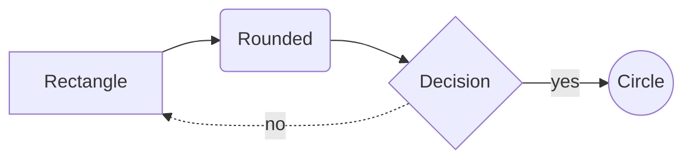

#### Block diagram

Keywords: `block` or `block-beta`.

- **Columns** — `columns 3` (or `columns auto`)
- **Column spans** — `b:2` makes a block span 2 columns
- **Space gaps** — `space` or `space:N`
- **Arrow blocks** — `api<["HTTP"]>(right)`
- **Edges** — `A --> B`, `A -- "label" --> B`

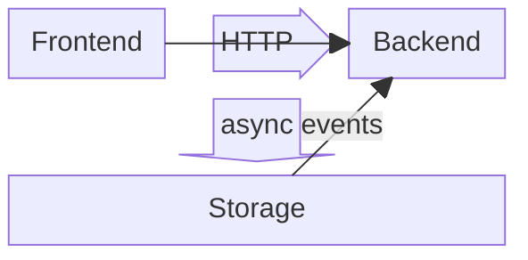

#### Sequence diagram

Keyword: `sequenceDiagram`.

- **Participants** — `participant A`, `participant A as Alice`
- **Messages** — `A->>B: Hello`, `B-->>A: Hi back`
- **Auto-created participants** — undeclared participants are created on first use

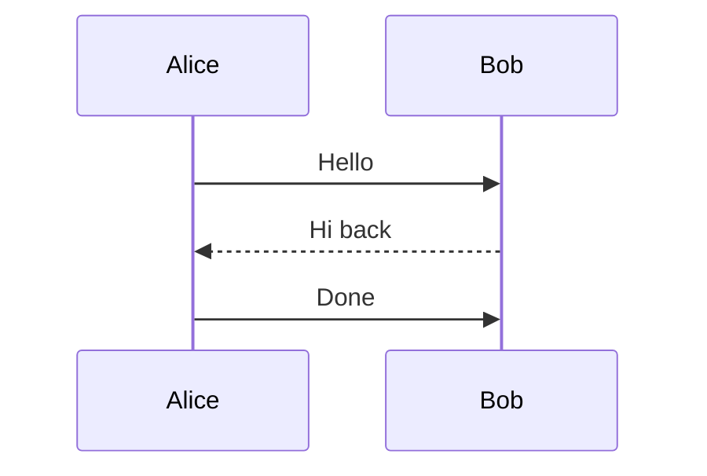

#### State diagram

Keywords: `stateDiagram` or `stateDiagram-v2`.

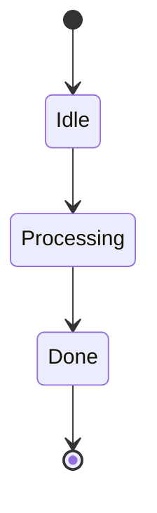

#### Mindmap

Keyword: `mindmap`. Uses indentation for hierarchy.

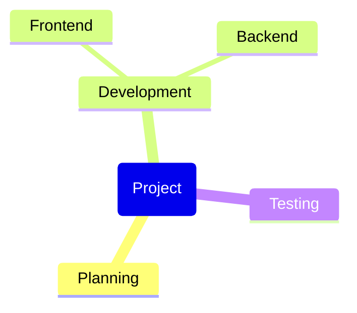

#### Timeline

Keyword: `timeline`.

- **Title** — `title Product Roadmap`
- **Periods and entries** — `Q1 : Research`

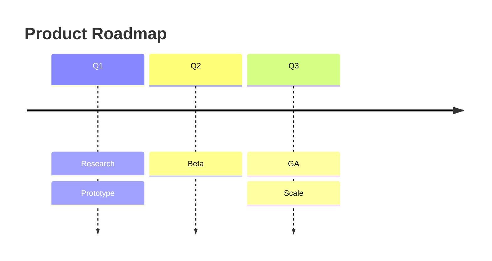

#### Venn diagram

Keyword: `venn-beta`.

- **Sets** — `set A["Alpha"]`
- **Unions** — `union A,B[Shared]`
- **Nested text** — `text Label["Detail"]`

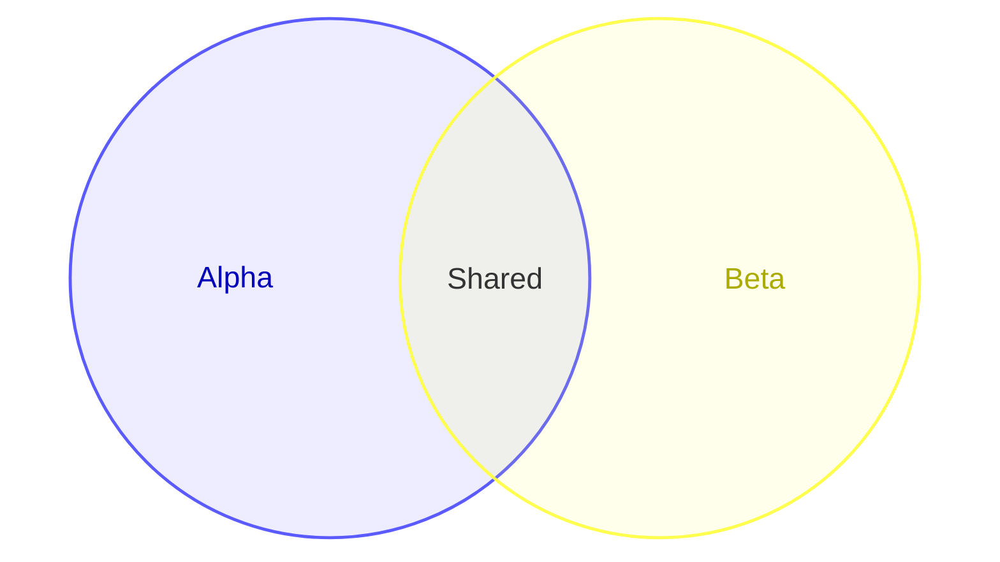

#### Architecture diagram

Keyword: `architecture-beta`.

- **Groups** — `group api(cloud)[API]`
- **Services** — `service db(database)[Database] in api`
- **Junctions** — `junction center`
- **Port-aware edges** — `db:L -- R:server`

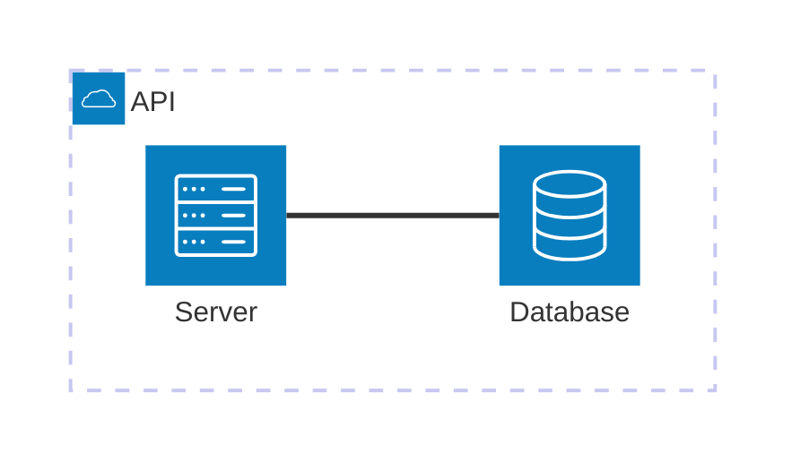

#### Class diagram

Keyword: `classDiagram`.

- **Classes** — `class Animal`, implicit classes via relationships, and bracket labels such as `class Animal["A base Animal"]`
- **Members** — both `Animal : +String name` and `class Animal { +makeSound() void }`
- **Stereotypes / annotations** — inline `class Shape <<interface>>`, separate-line `<<interface>> Shape`, or nested inside a class block
- **Relationships** — inheritance, composition, aggregation, association, solid link, dependency, realization, and dashed link
- **Namespaces** — `namespace BaseShapes { ... }`
- **Cardinality / multiplicity** — quoted end labels such as `Customer "1" --> "*" Ticket`
- **Direction** — `direction LR`, `RL`, `TB`, `BT`, `TD`

```mermaid
classDiagram
  class Shape <<interface>>
  class Rectangle {
    +double width
    +double height
    +area() double
  }
  namespace BaseShapes {
    Shape <|-- Rectangle
  }
  Customer "1" --> "*" Rectangle : owns
```

#### XY chart

Keyword: `xychart-beta`.

- **Title** — `title "Revenue"`
- **X axis** — `x-axis [Q1, Q2, Q3]`
- **Y axis** — `y-axis "USD" 0 --> 100`
- **Series** — `bar [...]`, `line [...]`

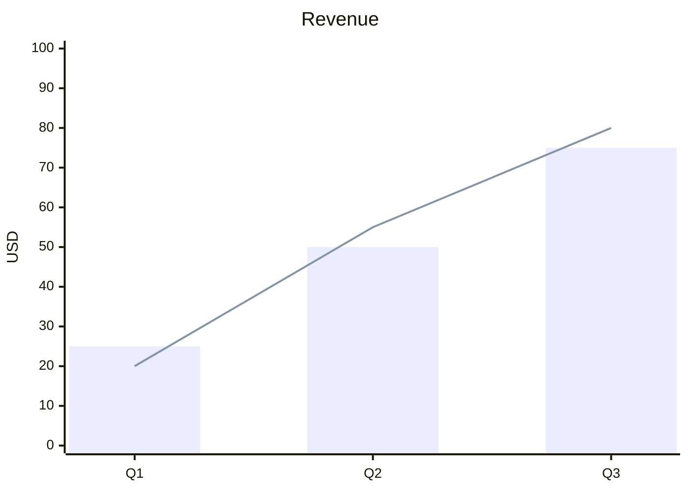

Not yet supported: ER diagrams, gantt, git graphs, requirement diagrams, C4, sankey, `click` directives, ELK flowchart layout, and full Mermaid feature parity within every supported diagram family.

Current class-diagram limitations: two-way relations (`<|--|>`), lollipop interfaces (`()--` / `--()`), notes, `style` / `classDef` / CSS classes, `click` interactions, and `hideEmptyMembersBox` configuration are not implemented yet.

### Conceptual DSL

A small YAML-ish format for presentation-native layouts that are awkward to express cleanly in Mermaid. First line is always `diagram: <type>`.

Rule of thumb: if the diagram is already easy to describe as Mermaid, use Mermaid. Use the Conceptual DSL when the primary value is a slide-style visual form such as a matrix, segmented pyramid, funnel, chevron process, or circular cycle.

#### If You Want This, Use This

| If you want... | Use... | Example |
| --- | --- | --- |
| Overlapping sets / Venn | Mermaid | `venn-beta\n  set A\n  set B\n  union A,B[Shared]` |
| Generic relationship diagram | Mermaid flowchart | `flowchart LR\n  Strategy --> Execution\n  Execution --> Results` |
| Hierarchy / org-style tree | Mermaid mindmap or flowchart | `mindmap\n  root(Company)\n    Product\n    Engineering\n    Sales` |
| Timeline / phased milestones | Mermaid timeline | `timeline\n  title Launch\n  Q1 : Plan\n  Q2 : Build\n  Q3 : Release` |
| 2x2 quadrant / prioritization matrix | Conceptual DSL | `diagram: matrix\nrows:\n  - Important\n  - Not Important\ncolumns:\n  - Urgent\n  - Not Urgent` |
| Layered strategy / capability stack | Conceptual DSL | `diagram: pyramid\nlevels:\n  - Vision\n  - Strategy\n  - Tactics` |
| Staged narrowing flow (awareness → conversion) | Conceptual DSL | `diagram: funnel\nstages:\n  - Awareness\n  - Evaluation\n  - Conversion` |
| Parallel pillars / workstreams | Conceptual DSL | `diagram: pillars\npillars:\n  - title: People\n    segments:\n      - Skills\n  - title: Process` |
| Iterative process / feedback loop (3–6 steps) | Conceptual DSL | `diagram: cycle\nsteps:\n  - Plan\n  - Build\n  - Measure\n  - Learn` |
| Sequential stage process (slide-style chevrons) | Conceptual DSL | `diagram: chevrons\nsteps:\n  - Discover\n  - Build\n  - Launch\n  - Learn` |
| Central concept with surrounding pillars / capabilities (3–8 items) | Conceptual DSL | `diagram: radial\ncenter: Platform\nitems:\n  - Security\n  - Reliability\n  - Observability` |
| Concentric strategy / segmentation target | Conceptual DSL | `diagram: target\ncenter: Launch\nrings:\n  - Inner ring: Pricing and messaging\n  - Outer ring: Audience reach` |
| Visual step-by-step journey / snake timeline (3+ steps) | Conceptual DSL | `diagram: snake\ntitle: Journey\nsteps:\n  - Start: Begin here\n  - Middle: Keep going\n  - End: Arrive` |

Planned conceptual additions are aimed at presentation-native graphics that Mermaid does not cover idiomatically, such as tree hierarchies / org charts.

#### chevrons

Horizontal process diagram using chevron (arrow) shapes arranged in a seamless stage sequence. Ideal for sequential stage flows such as product discovery, delivery pipelines, or onboarding steps. Each step is rendered as a pointed chevron stage; the first stage has a flat left edge and subsequent stages have a notched left edge that abuts the tip of the preceding stage.

```text
diagram: chevrons
steps:
  - Discover
  - Build
  - Launch
  - Learn
```

Requires at least 2 steps.

#### matrix

```text
diagram: matrix
rows:
  - Important
  - Not Important
columns:
  - Urgent
  - Not Urgent
```

#### pyramid

```text
diagram: pyramid
levels:
  - Vision
  - Strategy
  - Tactics
```

#### funnel

Vertical funnel layout for staged narrowing flows such as awareness → consideration → conversion, intake → review → approval, or backlog triage. Stages are listed top-to-bottom; each stage is rendered as a progressively narrowing trapezoid.

```text
diagram: funnel
stages:
  - Awareness
  - Evaluation
  - Conversion
```

#### cycle

Circular diagram for iterative processes and feedback loops. Accepts 3–6 steps arranged in a balanced radial layout with directional connectors.

```text
diagram: cycle
steps:
  - Plan
  - Build
  - Measure
  - Learn
```

#### pillars

```text
diagram: pillars
pillars:
  - title: People
    segments:
      - Skills
      - Roles
  - title: Process
    segments:
      - Intake
      - Delivery
  - title: Technology
    segments:
      - Platform
      - Tooling
```

Supported: 2-5 pillars, optional stacked `segments` per pillar. Segments are optional; a pillar with no `segments:` block renders as a single title block.

#### radial

Hub-and-spoke layout for strategy, architecture, and capability diagrams. One central concept is rendered as a circle, with 3–8 surrounding items connected by straight spoke connectors.

```text
diagram: radial
center: Platform
items:
  - Security
  - Reliability
  - Developer Experience
  - Observability
```

Supported: 3–8 items. Items are placed evenly around the center at equal angles, starting at the top (12 o'clock).

#### target

Concentric target layout for strategy, segmentation, launch focus, or maturity narratives. One central outcome is surrounded by 2–5 rings, with matching callout cards stacked to the right.

```text
diagram: target
title: Launch Focus
center: Launch
rings:
  - Inner ring: Pricing, messaging, and activation readiness
  - Middle ring: Programs and execution
  - Outer ring: Audience reach and partner signal
```

Rings are listed from outermost to innermost. The callout cards preserve that order from top to bottom.

#### snake

Snake timeline layout for journeys, processes, and step-by-step narratives. Steps are rendered as large circles connected by a weaving semicircular path that alternates above and below. Each step supports an optional icon and description.

```text
diagram: snake
title: The Fellowship's Journey
steps:
  - icon:heroicons:globe-alt The Shire: Bilbo's farewell party and Frodo inherits the One Ring
  - icon:heroicons:user-group Rivendell: The Council of Elrond forms the Fellowship of the Ring
  - icon:heroicons:fire Moria: Gandalf falls battling the Balrog on the Bridge of Khazad-dum
  - icon:heroicons:shield-check Amon Hen: The Fellowship breaks as Boromir falls defending the hobbits
  - icon:heroicons:eye Mordor: Frodo and Sam destroy the Ring in the fires of Mount Doom
```

Requires at least 3 steps. Each step follows the format `Label: Description` — the description is optional. Icons use the standard `icon:pack:name` prefix.

## Architecture

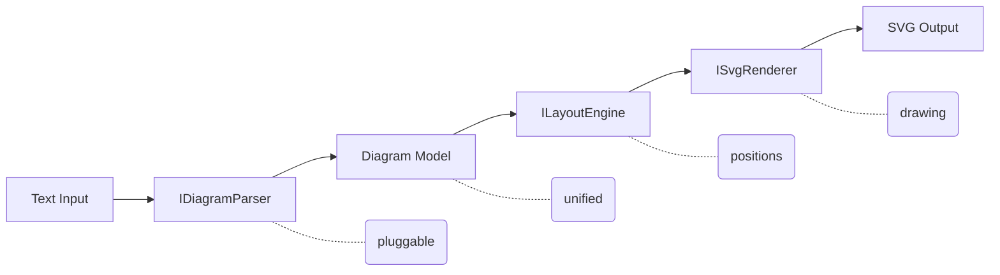

Parsers produce a syntax-independent `Diagram` (nodes, edges, groups, labels, layout hints). The layout engine assigns coordinates. The SVG renderer draws. Every stage is replaceable via the DI constructor on `DiagramRenderer`.

## Known limitations

- Mermaid support is intentionally incremental. If you need broad Mermaid.js feature coverage, DiagramForge is not a drop-in replacement.
- Frontmatter is recognized when the raw source starts with `---` and contains a closing `---` fence. Do not begin diagram content with a YAML-style fence unless you intend to use frontmatter.
- Snapshot tests compare canonicalized XML, so whitespace and attribute ordering are not significant in E2E baseline files.

## Roadmap

See [`doc/prd.md`](doc/prd.md) for the full plan. Short version: more Mermaid diagram types, more conceptual layouts, theme packs, eventually D2 and DOT parsers.

For analysis of which SmartArt-style conceptual diagrams are most worth adding next, see [`doc/smartart-analysis.md`](doc/smartart-analysis.md).

## Contributing

See [CONTRIBUTING.md](CONTRIBUTING.md).

## License

[MIT](LICENSE)
