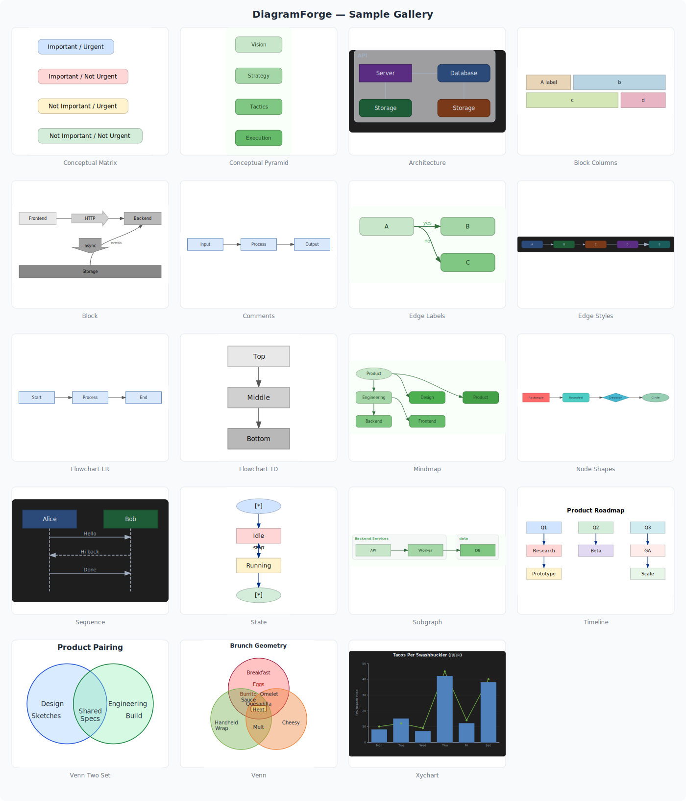
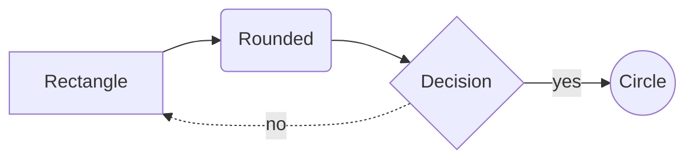
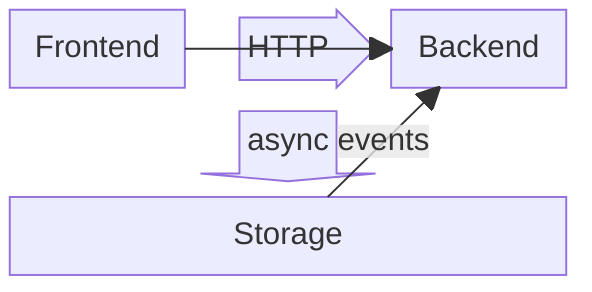
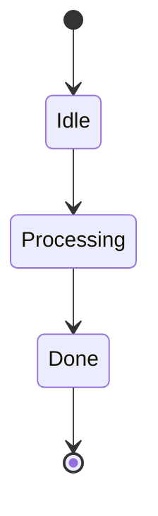
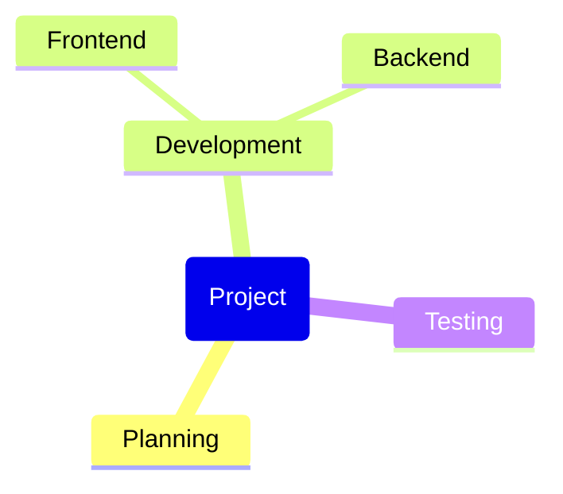
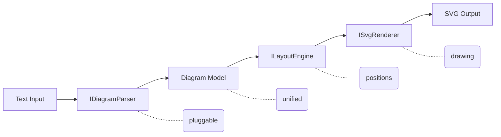

# DiagramForge

**Text in, SVG out.** A .NET library and CLI that turns plain-text diagram descriptions into clean, self-contained SVG — no browser, no JavaScript runtime, no headless Chrome.

<p align="center">
  
</p>

```csharp
var renderer = new DiagramRenderer();
string svg = renderer.Render("""
    flowchart LR
      A[Write] --> B[Build]
      B --> C{Tests pass?}
      C -->|yes| D[Ship]
      C -->|no| A
    """);
```

That's the whole API.

## Why

Most diagram-as-code tools assume a browser. Mermaid.js needs a JavaScript engine to run at all — and even once you've stood up headless Chrome and extracted the SVG, you find that it renders text via `<foreignObject>` wrapping HTML `<div>`s instead of native `<text>` elements. That's fine in a web page. It's a blank box in Inkscape, a parse error in Illustrator, and a mess when you try to drop it into a PowerPoint slide. See mermaid-js/mermaid [#2688](https://github.com/mermaid-js/mermaid/issues/2688), [#1845](https://github.com/mermaid-js/mermaid/issues/1845), [#1923](https://github.com/mermaid-js/mermaid/issues/1923), [#2169](https://github.com/mermaid-js/mermaid/issues/2169).

DiagramForge aims lower and hits harder: a **subset** of Mermaid, rendered to **actual** SVG. Flowcharts, block diagrams, state diagrams, and mindmaps — the output opens anywhere.

- **Real SVG.** Native `<text>` elements. No `<foreignObject>`, no embedded HTML, no CSS-in-SVG. Opens in Inkscape, imports into PowerPoint and Keynote, renders with librsvg.
- **Pure .NET.** `net10.0`, zero native dependencies, zero runtime package dependencies. No headless browser, no Node, no shelling out.
- **Deterministic.** Same input → byte-identical output. Safe to snapshot-test.
- **Theme-able.** Colors, fonts, spacing, corner radius — all overridable.
- **Pluggable.** Drop in your own `IDiagramParser` for custom syntaxes.

## Install

> **Pre-release.** Not yet published to NuGet. For now, clone and reference the project directly, or build and consume the DLL. See [CONTRIBUTING.md](CONTRIBUTING.md) for build instructions.

## Library usage

### Basic

```csharp
using DiagramForge;

var renderer = new DiagramRenderer();
string svg = renderer.Render(diagramText);
File.WriteAllText("out.svg", svg);
```

The renderer auto-detects the syntax from the input. No need to tell it whether it's Mermaid or Conceptual DSL.

### With a custom theme

```csharp
using DiagramForge;
using DiagramForge.Models;

var theme = new Theme
{
    NodeFillColor   = "#1F2937",
    NodeStrokeColor = "#6366F1",
    TextColor       = "#F9FAFB",
    FontFamily      = "Inter, sans-serif",
    BorderRadius    = 12,
};

string svg = new DiagramRenderer().Render(diagramText, theme);
```

Theme precedence: **diagram-embedded theme** › **argument theme** › **`Theme.Default`**.

### With a custom parser

```csharp
using DiagramForge;
using DiagramForge.Abstractions;

var renderer = new DiagramRenderer()
    .RegisterParser(new MyDotParser());   // tried before built-in parsers

// See what's registered
foreach (var id in renderer.RegisteredSyntaxes)
    Console.WriteLine(id);   // mydot, mermaid, conceptual
```

Implement `IDiagramParser`. You get two methods: `CanParse(string)` for sniffing the input, and `Parse(string)` which produces the unified `Diagram` model. Layout and rendering are handled for you.

## CLI usage

```text
diagramforge <input-file> [--output <output.svg>]
```

| Argument                | Description                                          |
| ----------------------- | ---------------------------------------------------- |
| `<input-file>`          | Path to a diagram source file. Syntax auto-detected. |
| `-o`, `--output <path>` | Write SVG to a file. Omit to write to stdout.        |
| `-h`, `--help`          | Show usage.                                          |

**Exit codes:** `0` success · `1` bad arguments / file not found · `2` parse error · `3` unexpected failure.

```sh
# write to file
diagramforge diagram.mmd -o diagram.svg

# pipe to something else
diagramforge diagram.txt | rsvg-convert -o diagram.png
```

## Supported syntax

### Mermaid (subset)

First line must start with one of the supported keywords below.

#### Flowchart

Keywords: `flowchart` or `graph` (+ optional direction suffix).

- **Directions** — `LR`, `RL`, `TB`, `BT`, `TD`
- **Node shapes** — `A[rect]`, `B(rounded)`, `C{diamond}`, `D((circle))`
- **Edges** — `-->` arrow, `---` line, `-.->` dotted, `==>` thick
- **Edge labels** — `A -->|label| B`
- **Subgraphs** — `subgraph title` / `end`
- **Comments** — `%% ignored`



#### Block diagram

Keywords: `block` or `block-beta`.

- **Columns** — `columns 3` (or `columns auto`)
- **Column spans** — `b:2` makes a block span 2 columns
- **Space gaps** — `space` or `space:N`
- **Arrow blocks** — `api<["HTTP"]>(right)`
- **Edges** — `A --> B`, `A -- "label" --> B`



#### State diagram

Keywords: `stateDiagram` or `stateDiagram-v2`.



#### Mindmap

Keyword: `mindmap`. Uses indentation for hierarchy.



Not yet supported: sequence diagrams, class diagrams, gantt, `click` directives, styling directives.

### Conceptual DSL

A small YAML-ish format for SmartArt-style diagrams. First line is always `diagram: <type>`.

#### venn

```text
diagram: venn
sets:
  - Engineering
  - Product
  - Design
```

#### matrix

```text
diagram: matrix
rows:
  - Important
  - Not Important
columns:
  - Urgent
  - Not Urgent
```

#### pyramid

```text
diagram: pyramid
levels:
  - Vision
  - Strategy
  - Tactics
```

## Architecture



Parsers produce a syntax-independent `Diagram` (nodes, edges, groups, labels, layout hints). The layout engine assigns coordinates. The SVG renderer draws. Every stage is replaceable via the DI constructor on `DiagramRenderer`.

## Roadmap

See [`doc/prd.md`](doc/prd.md) for the full plan. Short version: more Mermaid diagram types, more conceptual layouts, theme packs, eventually D2 and DOT parsers.

## Contributing

See [CONTRIBUTING.md](CONTRIBUTING.md).

## License

[MIT](LICENSE)
