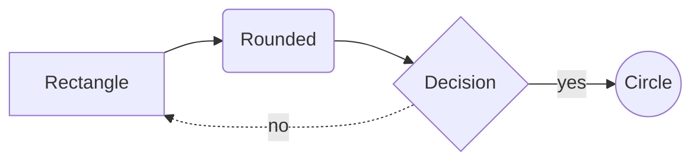
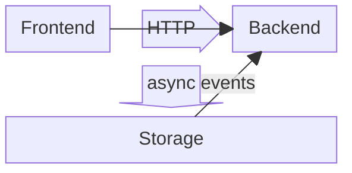
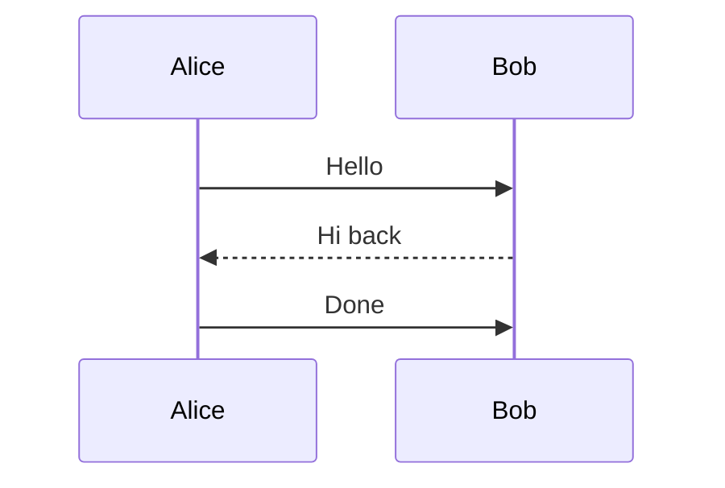
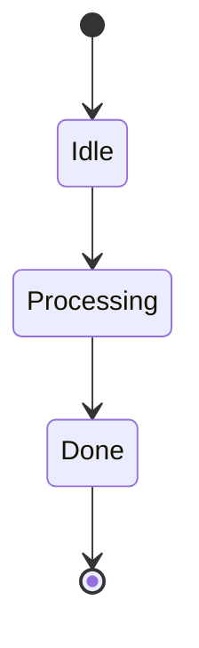
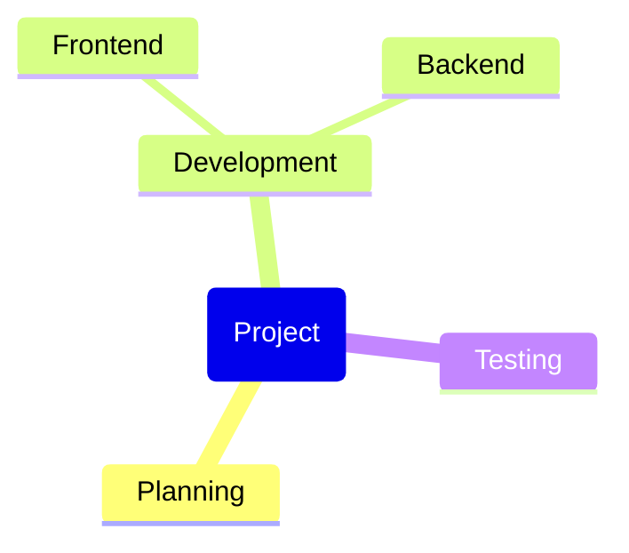
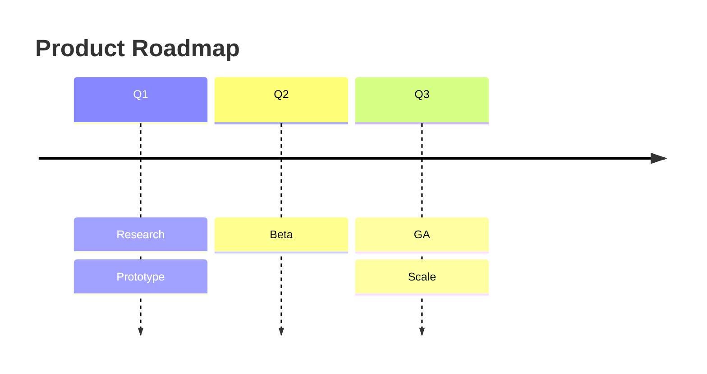
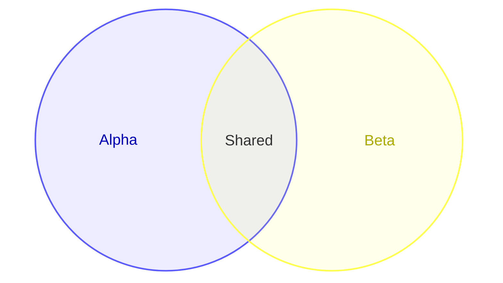
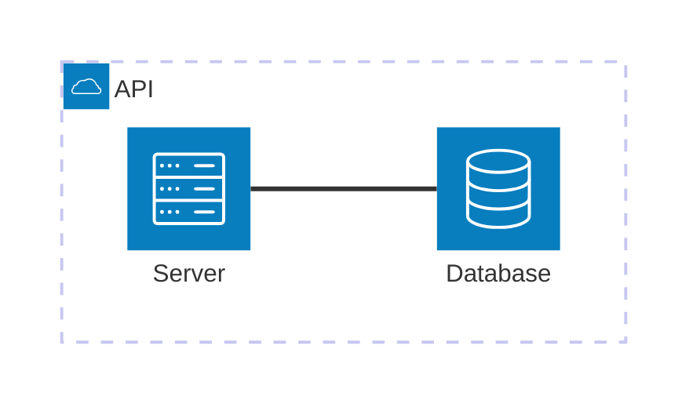
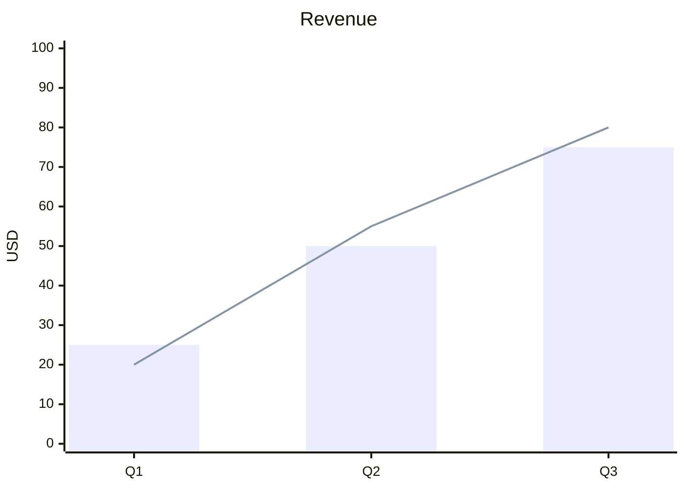
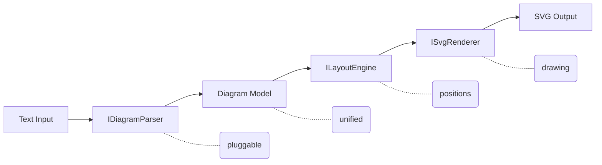

# DiagramForge

[](https://github.com/jongalloway/DiagramForge/actions/workflows/ci.yml)
[](https://www.nuget.org/packages/DiagramForge)
[](https://www.nuget.org/packages/DiagramForge)
[](https://mermaid.js.org)

**Text in, SVG out.** A .NET library and CLI that turns plain-text diagram descriptions into clean, self-contained SVG — no browser, no JavaScript runtime, no headless Chrome.


```csharp
var renderer = new DiagramRenderer();
string svg = renderer.Render("""
    flowchart LR
      A[Write] --> B[Build]
      B --> C{Tests pass?}
      C -->|yes| D[Ship]
      C -->|no| A
    """);
```

That's the whole API.

## Why

Most diagram-as-code tools assume a browser. Mermaid.js needs a JavaScript engine to run at all — and even once you've stood up headless Chrome and extracted the SVG, you find that it renders text via `<foreignObject>` wrapping HTML `<div>`s instead of native `<text>` elements. That's fine in a web page. It's a blank box in Inkscape, a parse error in Illustrator, and a mess when you try to drop it into a PowerPoint slide. See mermaid-js/mermaid [#2688](https://github.com/mermaid-js/mermaid/issues/2688), [#1845](https://github.com/mermaid-js/mermaid/issues/1845), [#1923](https://github.com/mermaid-js/mermaid/issues/1923), [#2169](https://github.com/mermaid-js/mermaid/issues/2169).

DiagramForge aims lower and hits harder: a **subset** of Mermaid, rendered to **actual** SVG. Flowcharts, block diagrams, sequence diagrams, state diagrams, mindmaps, timelines, Venn diagrams, architecture diagrams, and XY charts — the output opens anywhere.

- **Real SVG.** Native `<text>` elements. No `<foreignObject>`, no embedded HTML, no CSS-in-SVG. Opens in Inkscape, imports into PowerPoint and Keynote, renders with librsvg.
- **Pure .NET.** `net10.0`, zero native dependencies, zero runtime package dependencies. No headless browser, no Node, no shelling out.
- **Deterministic.** Same input → byte-identical output. Safe to snapshot-test.
- **Theme-able.** Colors, fonts, spacing, corner radius — all overridable.
- **Pluggable.** Drop in your own `IDiagramParser` for custom syntaxes.

## Install

### Library

```sh
dotnet add package DiagramForge
```

### CLI (.NET tool)

```sh
dotnet tool install -g DiagramForge.Tool
```

## Library usage

### Basic

```csharp
using DiagramForge;

var renderer = new DiagramRenderer();
string svg = renderer.Render(diagramText);
File.WriteAllText("out.svg", svg);
```

The renderer auto-detects the syntax from the input. No need to tell it whether it's Mermaid or Conceptual DSL.

### With a custom theme

```csharp
using DiagramForge;
using DiagramForge.Models;

var theme = new Theme
{
    NodeFillColor   = "#1F2937",
    NodeStrokeColor = "#6366F1",
    TextColor       = "#F9FAFB",
    FontFamily      = "Inter, sans-serif",
    BorderRadius    = 12,
  TransparentBackground = true,
};

string svg = new DiagramRenderer().Render(diagramText, theme);
```

Theme precedence: **diagram-embedded theme** › **argument theme** › **`Theme.Default`**.

### With a custom parser

```csharp
using DiagramForge;
using DiagramForge.Abstractions;

var renderer = new DiagramRenderer()
    .RegisterParser(new MyDotParser());   // tried before built-in parsers

// See what's registered
foreach (var id in renderer.RegisteredSyntaxes)
    Console.WriteLine(id);   // mydot, mermaid, conceptual
```

Implement `IDiagramParser`. You get two methods: `CanParse(string)` for sniffing the input, and `Parse(string)` which produces the unified `Diagram` model. Layout and rendering are handled for you.

## CLI usage

```text
diagramforge <input-file> [--output <output.svg>]
```

| Argument                | Description                                          |
| ----------------------- | ---------------------------------------------------- |
| `<input-file>`          | Path to a diagram source file. Syntax auto-detected. |
| `-o`, `--output <path>` | Write SVG to a file. Omit to write to stdout.        |
| `--transparent`         | Omit the SVG background rect for overlay/embed use.  |
| `-h`, `--help`          | Show usage.                                          |

**Exit codes:** `0` success · `1` bad arguments / file not found · `2` parse error · `3` unexpected failure.

```sh
# write to file
diagramforge diagram.mmd -o diagram.svg

# render for overlay on an existing page background
diagramforge diagram.mmd --theme dracula --transparent -o overlay.svg

# pipe to something else
diagramforge diagram.txt | rsvg-convert -o diagram.png
```

## Supported syntax

### Mermaid (subset)

First line must start with one of the supported keywords below.

| Diagram family | Keywords | Current support |
| --- | --- | --- |
| Flowchart | `flowchart`, `graph` | Direction, shapes, edges, labels, subgraphs |
| Block diagram | `block`, `block-beta` | Columns, spans, arrow blocks, labeled edges |
| Sequence diagram | `sequenceDiagram` | Participants, aliases, messages, auto-created participants |
| State diagram | `stateDiagram`, `stateDiagram-v2` | Terminals, transitions, transition labels |
| Mindmap | `mindmap` | Indentation-based hierarchy |
| Timeline | `timeline` | Title, periods, multiple entries per period |
| Venn diagram | `venn-beta` | Sets, unions, nested text, basic styles |
| Architecture diagram | `architecture-beta` | Groups, services, junctions, port-aware edges |
| XY chart | `xychart-beta` | Title, x/y axes, bar series, line series |

#### Flowchart

Keywords: `flowchart` or `graph` (+ optional direction suffix).

- **Directions** — `LR`, `RL`, `TB`, `BT`, `TD`
- **Node shapes** — `A[rect]`, `B(rounded)`, `C{diamond}`, `D((circle))`
- **Edges** — `-->` arrow, `---` line, `-.->` dotted, `==>` thick
- **Edge labels** — `A -->|label| B`
- **Subgraphs** — `subgraph title` / `end`
- **Comments** — `%% ignored`



#### Block diagram

Keywords: `block` or `block-beta`.

- **Columns** — `columns 3` (or `columns auto`)
- **Column spans** — `b:2` makes a block span 2 columns
- **Space gaps** — `space` or `space:N`
- **Arrow blocks** — `api<["HTTP"]>(right)`
- **Edges** — `A --> B`, `A -- "label" --> B`



#### Sequence diagram

Keyword: `sequenceDiagram`.

- **Participants** — `participant A`, `participant A as Alice`
- **Messages** — `A->>B: Hello`, `B-->>A: Hi back`
- **Auto-created participants** — undeclared participants are created on first use



#### State diagram

Keywords: `stateDiagram` or `stateDiagram-v2`.



#### Mindmap

Keyword: `mindmap`. Uses indentation for hierarchy.



#### Timeline

Keyword: `timeline`.

- **Title** — `title Product Roadmap`
- **Periods and entries** — `Q1 : Research`



#### Venn diagram

Keyword: `venn-beta`.

- **Sets** — `set A["Alpha"]`
- **Unions** — `union A,B[Shared]`
- **Nested text** — `text Label["Detail"]`



#### Architecture diagram

Keyword: `architecture-beta`.

- **Groups** — `group api(cloud)[API]`
- **Services** — `service db(database)[Database] in api`
- **Junctions** — `junction center`
- **Port-aware edges** — `db:L -- R:server`



#### XY chart

Keyword: `xychart-beta`.

- **Title** — `title "Revenue"`
- **X axis** — `x-axis [Q1, Q2, Q3]`
- **Y axis** — `y-axis "USD" 0 --> 100`
- **Series** — `bar [...]`, `line [...]`



Not yet supported: class diagrams, gantt, `click` directives, and full Mermaid feature parity within every supported diagram family.

### Conceptual DSL

A small YAML-ish format for presentation-native layouts that are awkward to express cleanly in Mermaid. First line is always `diagram: <type>`.

Rule of thumb: if the diagram is already easy to describe as Mermaid, use Mermaid. Use the Conceptual DSL when the primary value is a slide-style visual form such as a matrix, segmented pyramid, or circular cycle.

#### If You Want This, Use This

| If you want... | Use... | Example |
| --- | --- | --- |
| Overlapping sets / Venn | Mermaid | `venn-beta\n  set A\n  set B\n  union A,B[Shared]` |
| Generic relationship diagram | Mermaid flowchart | `flowchart LR\n  Strategy --> Execution\n  Execution --> Results` |
| Hierarchy / org-style tree | Mermaid mindmap or flowchart | `mindmap\n  root(Company)\n    Product\n    Engineering\n    Sales` |
| Timeline / phased milestones | Mermaid timeline | `timeline\n  title Launch\n  Q1 : Plan\n  Q2 : Build\n  Q3 : Release` |
| 2x2 quadrant / prioritization matrix | Conceptual DSL | `diagram: matrix\nrows:\n  - Important\n  - Not Important\ncolumns:\n  - Urgent\n  - Not Urgent` |
| Layered strategy / capability stack | Conceptual DSL | `diagram: pyramid\nlevels:\n  - Vision\n  - Strategy\n  - Tactics` |
| Parallel pillars / workstreams | Conceptual DSL | `diagram: pillars\npillars:\n  - title: People\n    segments:\n      - Skills\n  - title: Process` |
| Iterative process / feedback loop (3–6 steps) | Conceptual DSL | `diagram: cycle\nsteps:\n  - Plan\n  - Build\n  - Measure\n  - Learn` |

Planned conceptual additions are aimed at presentation-native graphics that Mermaid does not cover idiomatically, such as funnel, chevron process, and radial / hub-and-spoke.
#### matrix

```text
diagram: matrix
rows:
  - Important
  - Not Important
columns:
  - Urgent
  - Not Urgent
```

#### pyramid

```text
diagram: pyramid
levels:
  - Vision
  - Strategy
  - Tactics
```

#### cycle

Circular diagram for iterative processes and feedback loops. Accepts 3–6 steps arranged in a balanced radial layout with directional connectors.

```text
diagram: cycle
steps:
  - Plan
  - Build
  - Measure
  - Learn
```

#### pillars

```text
diagram: pillars
pillars:
  - title: People
    segments:
      - Skills
      - Roles
  - title: Process
    segments:
      - Intake
      - Delivery
  - title: Technology
    segments:
      - Platform
      - Tooling
```

Supported: 2-5 pillars, optional stacked `segments` per pillar. Segments are optional; a pillar with no `segments:` block renders as a single title block.

## Architecture



Parsers produce a syntax-independent `Diagram` (nodes, edges, groups, labels, layout hints). The layout engine assigns coordinates. The SVG renderer draws. Every stage is replaceable via the DI constructor on `DiagramRenderer`.

## Roadmap

See [`doc/prd.md`](doc/prd.md) for the full plan. Short version: more Mermaid diagram types, more conceptual layouts, theme packs, eventually D2 and DOT parsers.

## Contributing

See [CONTRIBUTING.md](CONTRIBUTING.md).

## License

[MIT](LICENSE)
